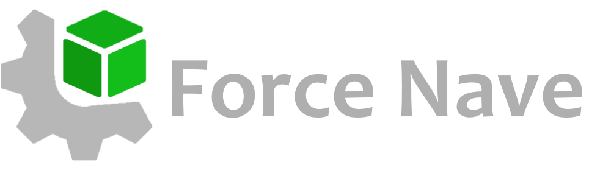

# Force-Nave

**Nave** is launcher for [Force Engine](https://github.com/KennyProgrammer/Force). That allows to create projects, manipulating and installing fresh builds of Force.

**NOTE:**
 Nave will be create projects on upcoming 0.4.0 version of Force, that is not released yet. When 0.4.0 will be released this is fixed automatically, so do not try create
 projects using Nave on latest 0.3.10 release (it may work or may not, only for testing).

### Documentation
You can read new documentation how install and work with engine, how write scripts and make games [here](https://danil-dukhovenko.gitbook.io/force/).

### License

Documentation Copyright (c) 2023 Dukhovenko Danila.\
Logo Copyright (c) 2023 Dukhovenko Danila.

Documentation released under [CC BY 4.0](https://creativecommons.org/licenses/by/4.0/).\
Logo released under [CC BY-SA 4.0](https://creativecommons.org/licenses/by-sa/4.0/).

